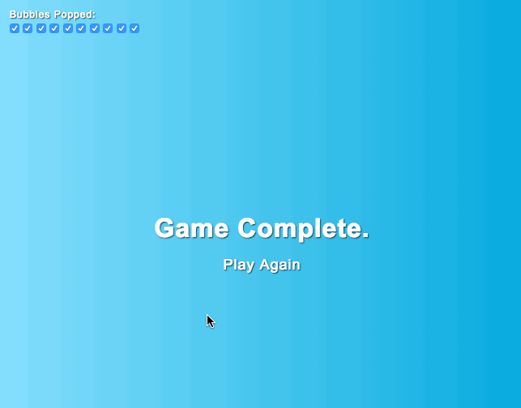

# Bubble Pop Game
A simple game written only in HTML and CSS, without Javascript.




### Try it out
[Codepen example](https://codepen.io/aoxrud/pen/gQbNGY) or run it locally via the [dist/index.html](dist/index.html) page.

### Why?
I was inspired by [The Mine: No JS, CSS only adventure game](https://codepen.io/jcoulterdesign/pen/NOMeEb) and decided to give it a try using the same checkboxes technique, but with a simpler game. A game that any young toddler would enjoy.

### Bubble Structure
```
  <input type='checkbox', id='checkbox-1' />
  <label for='checkbox-1'>
    <div class='bubble'></div>
  </label>
```

### How does the bubble popping work?
The code takes advantage of the default browser behavior that focuses on the input once the linked label is clicked.
When labels are used with checkboxes, clicking on the label will check the checkbox.

Each bubble is a `<label for='checkbox-1'>` element linked to a checkbox element `<input type='checkbox' id='checkbox-1' />`.
When a bubble is clicked, the linked checkbox is checked, then using the `input:checked` CSS selector one can detect when a bubble is popped and run the "pop" animation.

### How does the "game complete" work?
In order to know when all bubbles have been popped, the code looks for all the checkboxes to be `:checked`.
The caveat is that the code needs to know exactly how many bubbles there are, and for the elements to be laid out in a specific way so that one can use CSS's general sibling selector `~` to detect the states.

The html layout has a few checkboxes followed by a `<div class='complete'>`.

To select the `.complete` element once all the checkboxes are checked, the css selector looks something like this:
`#checkbox-1:checked ~ #checkbox-2:checked ~ .complete`

### Running at 60fps
The game runs smoothly and without flickering because of the use css properties that can be GPU accelerated.
GPU acceleration allows properties like `transform` and `opacity` to be transformed directly in the GPU and avoid software-based rendering.
Thus, by leveraging these properties for all the movement and animations of the bubbles; it allows the browser to run the game at 60fps for a smooth experience.


### How does the bubble pop at the clicked location?
The elements are laid out in such a way that each is responsible for a single task.
The `checkbox` is tied to the `label` and only responsible for tracking the popped state.
The `label` is the one that get animated from bottom to the top using `translateY` and it has a child element `.bubble` that is the actual bubble.
Once the checkbox is checked, trigger the `pop` animation on the `.bubble` element.


### Why did you use preprocessors?
Even though this could be written in vanilla html and css, it has a lot of repeated code which would be a nightmare to manually maintain and debug.
I've opted to use preprocessors like [pug](https://pugjs.org) and [sass](https://sass-lang.com/) to help with that.
The benefits of these preprocessors is that they offer things like loops and variables which keep the code concise and easily maintainable.

### Why is there a `package.json` if the game doesn't have javascript?
The `package.json` file is there to help with the preprocessing of css and html. There is no javascript used to run the game.

It will take care of watching for changes in the `src/` files and compiling them to plain css/html files in the `dist/` directory.

- Run `npm install` to install pug, sass, and watch tools.
- Run `npm run build` to build the `src/` into the `dist/`.
- Run `npm run watch` to run a watcher that will compile the source files in `src/` into `dist/` any time the source files change.